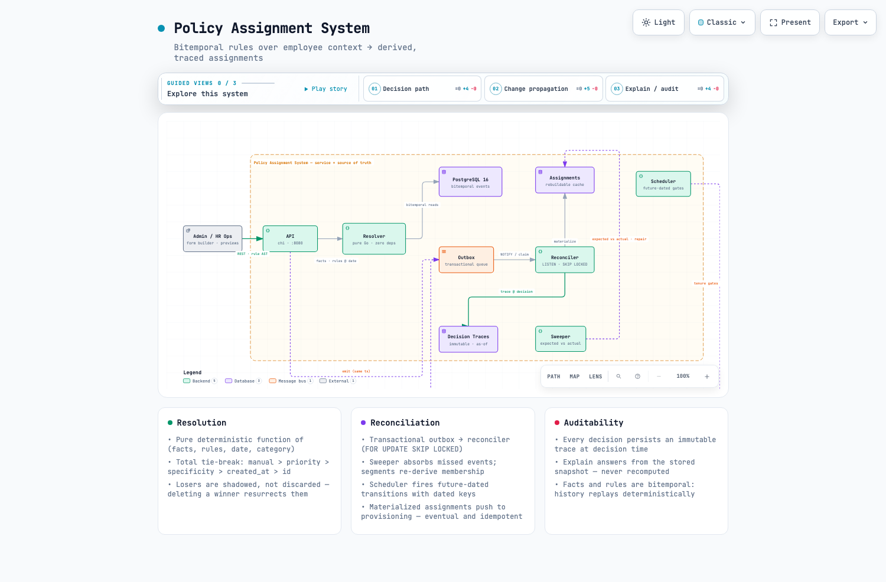

# Policy Assignment System — Submission

**A take-home system design for Warp: a generic substrate that decides *which
policies apply to which employees on any date* — for time off, pay schedules,
app access, trainings, benefits, managers, shifts, and holidays.**

Start here. Everything else in the repo supports this page.

---

## 🗺️ Interactive system map

**Open the clickable map of the whole system**
(guided views: decision path · change propagation · explain/audit):

→ **`system-map/index.html`** — live preview below; source is
`system-map/architecture.json` (rendered with Archify).



## The pitch (one paragraph)

Every feature in Warp — pay schedules, vacation policies, app access,
compliance trainings, benefits — is a variation of one pattern: *a rule over
employee context produces an assignment with a cardinality and a date.* We
built a single substrate for that pattern instead of one engine per feature.
Employee facts and rules are stored as **immutable, effective-dated events**
(bitemporal: business-time + processing-time). Resolution is a **pure,
deterministic function** `(facts@date, rules@date, category) → assignments` —
manual override > priority > automatic specificity > creation order breaks
every tie, and losing matches are *shadowed*, not discarded, so deleting a
winning rule resurrects the default. Every decision is explained by an
**immutable decision trace** written at decision time. Changes (attribute,
rule, group membership, tenure crossing) flow through a transactional outbox
into a **reconciler worker** that updates materialized projections, with a
**sweeper backstop** that repairs any drift — event-driven convergence with a
correctness floor.

## How to run it

```bash
# One command (Docker):
docker compose up --build            # Postgres + API (:8080) + worker
docker compose run --rm demo         # the scripted narrative (grader artifact)

# Or with a local Postgres:
make migrate && make demo
cat demo/output.txt                  # a captured run, committed
```

## Evaluation criteria → where each is satisfied

| Criterion | Where | Evidence |
|---|---|---|
| **Correct resolution & reconciliation** | Pure resolver (`resolver/`), reconciler+sweeper (`internal/reconciler/`) | Determinism property tests (200-permutation byte-identical), shadowing resurrection, drift repair proven live (9k traces, 0 failures) |
| **Deterministic + explainable conflicts** | `conflicts.go`, `trace.go` | Total order: manual > priority > specificity > created_at > id; every loss named ("lost specificity tiebreak to r_vac_ca_2yr (2 < 5)") |
| **User experience** | `docs/UX_FLOWS.md` + live API flows | Readiness checklist (auto / needs-decision / manual), save-gate previews, relocation diffs, explain inspector — all working endpoints, demoed in `demo/output.txt` |
| **Architecture choice** | `docs/ARCHITECTURE.md`, `docs/TECH_STACK.md`, `docs/DATA_MODEL.md` | Go 1.27 + Postgres bitemporal + sqlc + outbox/worker; choices and rejections documented with honest pros/cons |
| **Auditable** | `decision_trace` table + `GET /employees/{id}/explain` | "Why does X have Y as of Z?" answered from the stored, immutable trace — snapshots of the facts and policy config used; 9,000+ traces in the demo company |
| **Developer experience** | Repo layout, invariant discipline | Pure 0-dependency resolver (90% coverage), one sqlc↔resolver boundary, per-file tests, `AGENTS.md` invariants |
| **Clear communication** | This page + docs set | Doc map below; every doc cross-checks every other (validated) |

## Doc map

| File | Contents |
|---|---|
| `README.md` | Overview + quickstart |
| `SUBMISSION.md` | **This page** |
| `DECISIONS.md` | 16 scoping questions answered + sourced |
| `TECH_STACK.md` | Go 1.27, sqlc + pgx, chi, Postgres — choices & rejections |
| `docs/ARCHITECTURE.md` | Components, resolution/reconciliation flows, consistency contract |
| `docs/DATA_MODEL.md` | Full Postgres schema (bitemporal, outbox, segments, traces) |
| `docs/API.md` | HTTP contract; the canonical rule AST shared by API/builder/resolver |
| `docs/UX_FLOWS.md` | Admin flows: builder, save-gate diff, readiness, explain inspector |
| `docs/SCALE_NOTES.md` | 100k+ patterns that apply here (pooling, bulkheads, CDC-vs-outbox) |
| `docs/TRADEOFFS.md` | Honest pros/cons, scope limits, non-goals |
| `docs/PROTOTYPE_PLAN.md` | Build order — everything checked off |
| `demo/output.txt` | Captured run of the scripted narrative |
| `CHANGELOG.md` | What changed, session by session, including every bug live-runs caught |

## The demo proves (all real data, 1,000-employee company)

1. Onboarding → 10 auto-applied, 1 needs-decision (ranked options), 1 manual
2. Save-gate: previewing a rule shows exactly who gains/loses — nothing written
3. Relocation CA→NY → exact gain/lose diff (switches vs true loss)
4. 2-year tenure crossing → the enhanced policy shadows the default, traced
5. Deleting the winning rule → the loser resurrects (shadowed matches persist)
6. Explain: "why does X have Y as of Z?" from the stored immutable trace
7. Backdated correction → history replays; the earlier trace does not move

## Honest limitations

Full list in `docs/TRADEOFFS.md`. The short version: no UI (flows are
documented + API-backed), group membership = segment predicates rather than
arbitrary graph rules, Postgres-as-queue until high event rates, and the
docker image build was unverifiable on the author's network (every binary
itself is locally built and live-tested).

## Contact

Submission by design-evaluation; no shared credentials — everything runs
locally with `docker compose` or `make`.