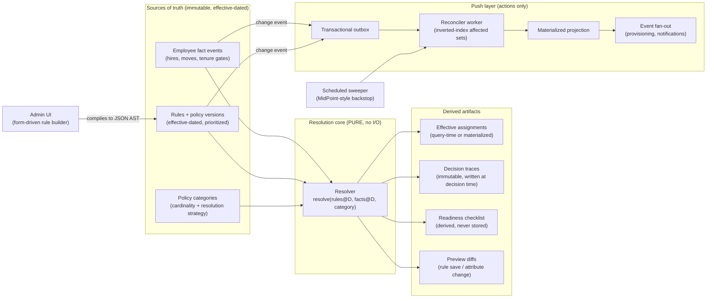
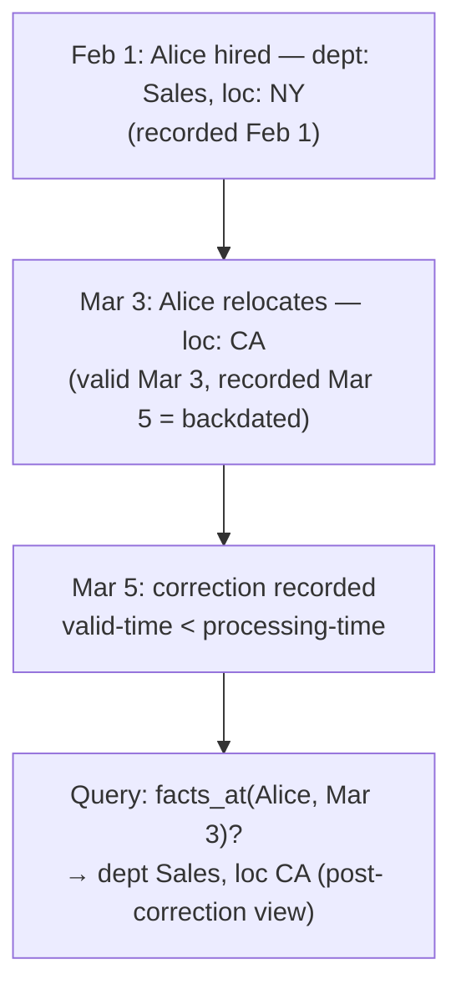
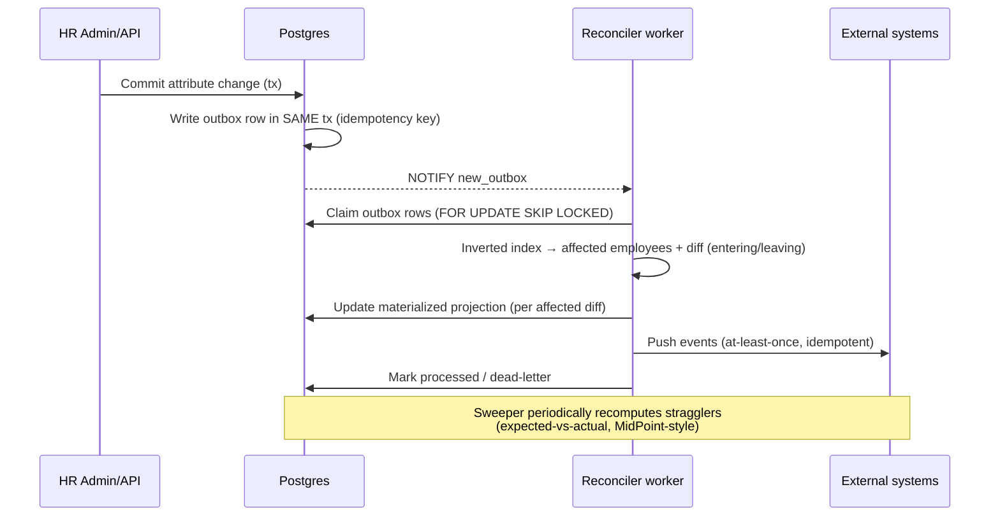

# Architecture

## System overview



## Components

### 1. Bitemporal event store (Postgres)

Everything that changes over time is an **append-only event with two clocks**:

- **valid time** — when the fact is true in the business world (`valid_range: daterange`),
  possibly in the future ("transfers to Engineering on the 15th") or backdated ("actually
  relocated to CA on Feb 1").
- **processing time** — when the system learned it (`recorded_at`), plus supersession pointers.

Employee attributes, rules, and policy definitions all live here. Nothing is `UPDATE`d in
place; a correction is a new event that supersedes the old one.



### 2. Resolver (pure function)

The heart of the system. **No I/O, no framework imports — a pure Go package.** Signature:

```go
func Resolve(
    facts    Facts,           // snapshot of attribute map at date D
    rules    []RuleVersion,   // effective, non-superseded rule versions at D
    category CategoryConfig,  // cardinality, resolution strategy, tiebreakers
    date     time.Time,
) ResolutionResult
// .Assignments — winner(s)
// .Shadowed    — matched-but-superseded rules (for 'single' categories)
// .Trace       — every rule evaluated: matched? why lost? inputs used
```

Pipeline inside `resolve`:

1. **Filter** — evaluate each rule's predicate against `facts` → matched set.
2. **Order** — sort matched rules by the deterministic total order:
   `manual_override → explicit priority desc → automatic specificity desc → (created_at, id)`.
3. **Select** — for `single` categories take the head; the rest become `shadowed`.
   For `many` categories take all (additive).
4. **Trace** — record per-rule: matched/not, failing predicate clause, loss reason,
   fact snapshot hash, policy version hash.

**Determinism invariants** (property-tested): same inputs → identical output, always;
`single` categories yield exactly one assignment or zero (with the reason in the trace).

#### Automatic specificity

Computed from the predicate AST, cached per rule version. Each conjunct narrows by the
cardinality of the attribute it constrains (`location = CA` narrows more than
`employment_type = full_time`). Ranked deterministically; explicit priority exists as the
admin's override when the automatic ranking surprises them.

### 3. Read path: pull for decisions

| Query | How it's served |
|---|---|
| "Policies for employee E on date D" | Compute-on-read via resolver; LRU cache keyed on `(policy_version_max, facts_version(E), D)` |
| "Why does E have P as of D?" | Read the stored decision trace (never recomputed — inputs may have changed) |
| "Assignments for payroll run of March" | Compute-on-read over the batch of employees; results cached per snapshot version |
| "What will change if we hire Bob with attrs X?" | Same resolver, hypothetical facts → readiness checklist |

A policy or rule edit bumps the snapshot version → all derived caches invalidate naturally.
No bespoke invalidation logic.

### 4. Write path: push for actions



- **Transactional outbox**: the change and its event commit atomically — no dual-write bug.
- **Inverted index**: `attribute_value → employee_ids` (Rippling Supergroup pattern). A rule
  edit or attribute change touches only the diff — employees entering or leaving the affected
  predicate scopes — never a full-company recompute.
- **Sweeper backstop**: a scheduled expected-vs-actual reconciliation catches missed events,
  guaranteeing the projection converges even after failures.

### 5. Consistency contract

> **Decision consistency is transactional; enforcement convergence is eventual and measured.**

- Reading decisions after a committed change is always correct (read-your-writes on facts).
- Materialized projections and external pushes converge within a bounded, observed SLA
  (seconds), with the sweeper as the correctness floor.
- The materialized table is **always a projection, never the source of truth** — it can be
  dropped and rebuilt from events at any time.

### 6. Scale path

| Employees | Strategy |
|---|---|
| ≤ 1k | Naive per-employee recompute on change is fine |
| ~10k (demo target) | Inverted-index affected sets + batched chunked recompute |
| ~100k | Same architecture; throughput problem only — chunking, parallel workers, per-shard (per-company) isolation. Single-tenant-per-company keeps resolution domains small. |

## Failure modes & how the design answers them

| Failure | Answer |
|---|---|
| Winning rule deleted → coverage silently vanishes | Shadowed matches persist; loser resurrects on next recompute |
| Backdated correction lands after payroll ran | Bitemporal replay: resolution for affected dates recomputes; traces flag the retro window |
| Two rules both match a `single` category | Deterministic total order; loser shadowed; full trace explains |
| Event lost after DB commit | Sweeper expected-vs-actual recompute catches drift |
| Admin fat-fingers a broad rule | Preview diff before save shows exactly who gains/loses |
| "Why did this change?" after the fact | Immutable decision traces keyed by (employee, category, window, trigger) |
