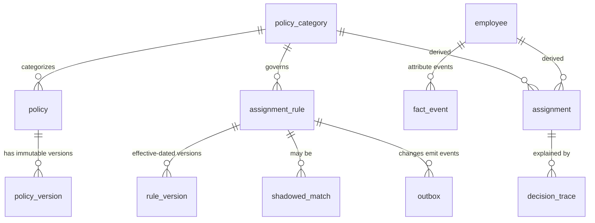

# Data Model

PostgreSQL schema. Three governing principles:

1. **Bitemporal, append-only** — every temporal record has a `valid_range` (business truth)
   and a processing-time column (`recorded_at`); corrections append, never update.
2. **Semantics are data, not code** — cardinality and conflict behavior are columns on
   `policy_category`; the resolver is one generic algorithm.
3. **No database-level foreign keys** — referential integrity is enforced at the application
   (repository) layer. Rationale: assignments are a rebuildable projection (hard FKs add
   migration friction during rebuilds and seed loads), the resolver already validates
   references when constructing typed inputs, and dropping FKs keeps bulk loads fast.
   The FK graph is still documented (see erDiagram) as the expected invariants.



> Note: manual assignments are not a separate table — they are rows in
> `assignment_rule` with `source = 'manual'`, so overrides flow through the same
> resolver, versioning, and audit paths as authored rules.

## Core tables

### `policy_category` — semantics live here

```sql
CREATE TABLE policy_category (
    id                  TEXT PRIMARY KEY,          -- 'pay_schedule', 'app_access', ...
    display_name        TEXT NOT NULL,
    cardinality         TEXT NOT NULL CHECK (cardinality IN ('single', 'many')),
    resolution_strategy TEXT NOT NULL CHECK (resolution_strategy IN
                            ('priority_rank', 'explicit_user_choice', 'additive')),
    default_priority    INT  NOT NULL DEFAULT 0,
    tiebreaker          TEXT NOT NULL DEFAULT 'priority_then_id',
    immutable_after_use BOOLEAN NOT NULL DEFAULT TRUE  -- semantics frozen once assignments exist
);
```

Changing semantics on an in-use category requires a migration + impact preview, so historical
traces stay interpretable.

### `policy` / `policy_version` — copy-on-write definitions

```sql
CREATE TABLE policy (
    id          TEXT PRIMARY KEY,
    category_id TEXT NOT NULL,
    name        TEXT NOT NULL,                    -- 'US Bi-Weekly Pay'
    payload     JSONB NOT NULL                    -- category-specific config
);

CREATE TABLE policy_version (
    id          TEXT PRIMARY KEY,
    policy_id   TEXT NOT NULL,
    version     INT  NOT NULL,
    payload     JSONB NOT NULL,
    valid_range DATERANGE NOT NULL,
    recorded_at TIMESTAMPTZ NOT NULL DEFAULT now(),
    UNIQUE (policy_id, version)
);
```

### `employee` / `fact_event` — bitemporal attributes

```sql
CREATE TABLE employee (
    id         TEXT PRIMARY KEY,
    company_id TEXT NOT NULL,
    hired_on   DATE
);

CREATE TABLE fact_event (
    id            BIGINT GENERATED ALWAYS AS IDENTITY PRIMARY KEY,
    employee_id   TEXT NOT NULL,
    attribute_key TEXT NOT NULL,                  -- 'location', 'department', 'employment_type', 'hire_date', ...
    value         JSONB NOT NULL,                 -- typed via attribute_definition registry
    valid_range   DATERANGE NOT NULL,             -- business truth (may be future or backdated)
    recorded_at   TIMESTAMPTZ NOT NULL DEFAULT now(),  -- 'second clock'
    superseded_by BIGINT,
    trigger       TEXT NOT NULL DEFAULT 'hr_edit' -- 'hr_edit' | 'tenure_gate' | 'system'
);

CREATE INDEX fact_event_asof ON fact_event (employee_id, attribute_key, valid_range);
```

**As-of query** ("facts for Alice on March 3"):

```sql
SELECT DISTINCT ON (attribute_key) attribute_key, value
FROM fact_event
WHERE employee_id = :id
  AND valid_range @> :date
  AND (superseded_by IS NULL OR recorded_at <= :as_of_processing_time)
ORDER BY attribute_key, valid_range DESC;
```

### `segment` / `segment_membership` — Supergroups (derived groups)

```sql
CREATE TABLE segment (
    id          TEXT PRIMARY KEY,
    company_id  TEXT NOT NULL,
    name        TEXT NOT NULL,
    predicate   JSONB NOT NULL,          -- canonical rule AST (same as rule predicates)
    created_at  TIMESTAMPTZ NOT NULL DEFAULT now()
);

CREATE TABLE segment_membership (
    segment_id  TEXT NOT NULL,
    employee_id TEXT NOT NULL,
    PRIMARY KEY (segment_id, employee_id)
);
```

Groups are **named, reusable rule predicates** whose membership is derived
state — rebuilt by the worker from the predicate, never hand-edited. Rules
match membership via the derived `segments` attribute + the `contains`
operator:

```jsonc
{ "attr": "segments", "op": "contains", "value": "field_ops" }
```

A segment change is an event like any other: rebuild membership → diff the
affected employees → reconcile exactly those. The sweeper re-derives
membership as a drift backstop so a missed event still converges.

### `attribute_definition` — the custom-attribute escape hatch

```sql
CREATE TABLE attribute_definition (
    key         TEXT PRIMARY KEY,                 -- 'field_ops_cohort'
    value_type  TEXT NOT NULL,                    -- 'string' | 'number' | 'date' | 'bool' | 'enum'
    allowed_ops TEXT[] NOT NULL,                  -- operators the rule builder may expose
    enum_values JSONB,                            -- for 'enum'
    description TEXT
);
```

The resolver operates on the generic attribute map only; registering a new attribute is a
data change, not a code change.

### `assignment_rule` / `rule_version` — predicates → policies

```sql
CREATE TABLE assignment_rule (
    id            TEXT PRIMARY KEY,
    category_id   TEXT NOT NULL,
    policy_id     TEXT NOT NULL,
    source        TEXT NOT NULL DEFAULT 'authored' CHECK (source IN ('authored', 'manual', 'system')),
    priority      INT  NOT NULL DEFAULT 0,        -- explicit, admin-set; ties broken later
    specificity   INT,                           -- computed from AST, cached per version
    created_at    TIMESTAMPTZ NOT NULL DEFAULT now()
);

CREATE TABLE rule_version (
    id            TEXT PRIMARY KEY,
    rule_id       TEXT NOT NULL,
    version       INT  NOT NULL,
    predicate     JSONB NOT NULL,                 -- canonical rule AST (see below)
    valid_range   DATERANGE NOT NULL,             -- 'takes effect Jan 1' = future interval
    recorded_at   TIMESTAMPTZ NOT NULL DEFAULT now(),
    UNIQUE (rule_id, version)
);
```

#### Rule AST (canonical JSON, shared by API + form builder + resolver)

```jsonc
{
  "op": "and",
  "clauses": [
    { "attr": "employment_type", "op": "eq",  "value": "contractor" },
    { "attr": "location",        "op": "in",  "value": ["US-CA"] },
    { "attr": "tenure_days",     "op": "gte", "value": 730, "derived_from": "hire_date" }
  ]
}
```

Tenure is a **derived attribute** computed from `hire_date` at resolve time — and a
tenure threshold can also be materialized as a scheduled future-dated `fact_event`
(`trigger = 'tenure_gate'`) so future transitions appear in the scheduler.

### `assignment` — derived, materialized only as a projection

```sql
CREATE TABLE assignment (
    employee_id       TEXT NOT NULL,
    category_id       TEXT NOT NULL,
    policy_id         TEXT NOT NULL,
    policy_version_id TEXT NOT NULL,
    rule_id           TEXT NOT NULL,              -- even for manual overrides (source='manual')
    valid_range       DATERANGE NOT NULL,
    computed_at       TIMESTAMPTZ NOT NULL,
    trigger_event_id  BIGINT,                     -- outbox row that caused this recompute
    PRIMARY KEY (employee_id, category_id, policy_id, valid_range)
);
-- This table is a CACHE. It can be truncated and rebuilt from events at any time.
```

### `decision_trace` — the audit artifact (the real deliverable)

```sql
CREATE TABLE decision_trace (
    id                BIGINT GENERATED ALWAYS AS IDENTITY PRIMARY KEY,
    employee_id       TEXT NOT NULL,
    category_id       TEXT NOT NULL,
    as_of_date        DATE  NOT NULL,
    trigger           TEXT NOT NULL,              -- 'materialize' | 'explain_query' | 'preview'
    outcome           TEXT NOT NULL,              -- 'assigned' | 'shadowed' | 'no_match' | 'conflict_needs_decision'
    facts_snapshot    JSONB NOT NULL,             -- attribute map used
    policy_snapshot   JSONB NOT NULL,             -- category config + rule versions used
    evaluated         JSONB NOT NULL,             -- per-rule: matched?, why_not/why_lost, rank position
    created_at        TIMESTAMPTZ NOT NULL DEFAULT now(),
    UNIQUE (employee_id, category_id, as_of_date, trigger, created_at)
);
```

Traces are written **at decision time** and never recomputed — recomputing would silently
change answers after inputs change. Retention: full traces for the audit window, aggregated
winner-only summaries beyond it.

### `shadowed_match` — losers that must resurrect

```sql
CREATE TABLE shadowed_match (
    employee_id  TEXT NOT NULL,
    category_id  TEXT NOT NULL,
    rule_id      TEXT NOT NULL,                   -- the shadowed (losing) rule
    by_rule_id   TEXT NOT NULL,                   -- the winning rule
    valid_range  DATERANGE NOT NULL
);
```

If the winning rule is deleted or narrowed, the reconciler promotes shadowed matches —
coverage never silently disappears.

### `outbox` — transactional events (audit + push)

```sql
CREATE TABLE outbox (
    id              BIGINT GENERATED ALWAYS AS IDENTITY PRIMARY KEY,
    event_type      TEXT NOT NULL,                -- 'fact_changed' | 'rule_changed' | 'category_changed'
    payload         JSONB NOT NULL,
    idempotency_key TEXT NOT NULL UNIQUE,
    recorded_at     TIMESTAMPTZ NOT NULL DEFAULT now(),
    processed_at    TIMESTAMPTZ,
    attempts        INT NOT NULL DEFAULT 0
);
-- Inserts are idempotent: ON CONFLICT (idempotency_key) DO NOTHING, so
-- retried emits (API retries, re-run dated scheduler keys) are safe no-ops.
```

### Inverted index — the reconciliation accelerator

```sql
CREATE TABLE attribute_index (                    -- Rippling 'Supergroup' pattern
    attribute_key   TEXT NOT NULL,
    value_hash      TEXT NOT NULL,               -- normalized value
    employee_ids    TEXT[] NOT NULL,
    updated_at      TIMESTAMPTZ NOT NULL DEFAULT now(),
    PRIMARY KEY (attribute_key, value_hash)
);
```

A rule change resolves its predicate to the union/intersection of index entries → the exact
affected set; a fact change diffs that employee's index memberships → entering/leaving rule
scopes. Reconciliation cost ∝ affected diff, never company size.

## Integrity guarantees worth highlighting

- **Deterministic tiebreak columns** (`priority`, `created_at`, `id`) are **stored, not
  derived at read time** — sorting is stable across replicas and replays.
- **UNIQUE constraints** protect determinism where it's absolute: `(policy_id, version)`,
  `(rule_id, version)`, `outbox.idempotency_key`.
- **Exclusion constraints for `single`-cardinality assignments** are applied per-deployment
  after a company's categories are configured (a partial unique index on
  `assignment (employee_id, category_id) WHERE ...` per single category), since which
  categories are `single` is data, not schema. Pattern:

  ```sql
  -- example: one pay schedule per employee at any instant
  -- requires: CREATE EXTENSION btree_gist;  (GiST opclass for text equality — verified live)
  ALTER TABLE assignment ADD CONSTRAINT one_pay_schedule
    EXCLUDE USING gist (employee_id WITH =, category_id WITH =, valid_range WITH &&)
    WHERE (category_id = 'pay_schedule');
  ```
- **`immutable_after_use`** on categories protects historical interpretability.
