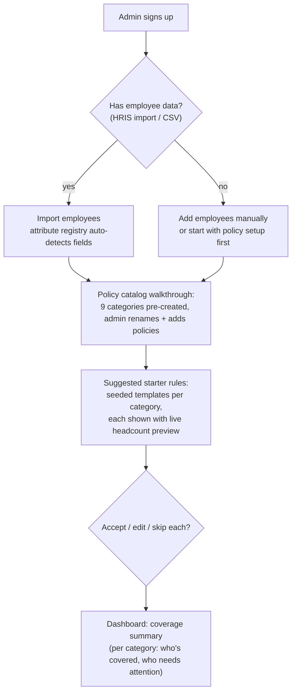

# UX Flows

The admin persona: **HR ops at a ~200-person company, no technical help.** Every flow
compiles to the same canonical rule AST the engine consumes — the UI is a skin over the
resolver, and every preview reuses the production resolver, so previews can't drift from
reality.

---

## 1. First-run setup (company admin, day zero)



Design intent: the admin never faces a blank page. Each starter rule ships with
*"This would cover **23** people: e.g. Alice Chen, Raj Patel, …"* — the match preview is the
first thing they see, before they've committed to anything.

## 2. Authoring a rule (form-driven builder)

**Never a raw expression language for this persona.** The builder is
attribute → operator → value, with AND grouping (OR via saved segments):

```
┌──────────────────────────────────────────────────────────────┐
│ New rule — Time off: Vacation (California Enhanced)          │
│                                                              │
│  APPLIES TO EMPLOYEES WHERE                                  │
│  ┌────────────────┐ ┌──────────┐ ┌─────────────────────┐     │
│  │ Location       │ │ is in    │ │ [California ▾]  (×) │     │
│  └────────────────┘ └──────────┘ └─────────────────────┘     │
│  AND                                                         │
│  ┌────────────────┐ ┌──────────┐ ┌─────────────────────┐     │
│  │ Tenure         │ │ at least │ │ 2 years         (×) │     │
│  └────────────────┘ └──────────┘ └─────────────────────┘     │
│  + Add condition                                             │
│                                                              │
│  ASSIGN POLICY: [California Enhanced Vacation ▾]             │
│  EFFECTIVE: [Immediately ▾] / on date [________]             │
│  PRIORITY: [Standard ▾]  (Higher priority wins conflicts)    │
└──────────────────────────────────────────────────────────────┘
```

Key behaviors:

- **Live match preview** — headcount + first few sample employees updates as they type.
- **Tenure is a first-class input** ("at least 2 years"), not a date-math exercise.
- **Effective date picker** — "immediately" or future-dated; future-dating is a first-class
  concept, shown in the rule list with a "starts Jan 1" badge.
- **Priority is exposed as High/Standard/Low**, not integers — with a plain-language explainer:
  *"When two rules both match an employee and only one policy of this kind is allowed, the
  higher-priority rule wins."*

### The save gate: diff preview

Before saving any rule (new or edited), the admin must pass through:

```
┌──────────────────────────────────────────────────────────────┐
│ Saving this rule will change 17 employees:                   │
│                                                              │
│  ✚ 15 gain California Enhanced Vacation                      │
│     Alice Chen, Raj Patel, +13 more                          │
│  ⚠ 2 LOSE their current vacation policy                      │
│     Sam Okafor (lost to higher priority: "US Bi-Weekly...",  │
│     Jane Luo (lost to manual override by Dana W. on Aug 12)  │
│                                                              │
│  [Show full diff]   [Cancel]   [Save & apply]                │
└──────────────────────────────────────────────────────────────┘
```

The diff is computed by running the resolver with and without the new rule — the same engine,
so it is exact, including shadowing effects.

## 3. Onboarding a new employee — the readiness checklist

The mental model: **the system auto-assigns everything it can, and shows a checklist of only
what needs a human.**

```
┌──────────────────────────────────────────────────────────────┐
│ Onboard: Priya Sharma — Engineering, California, Full-time   │
│                                                              │
│  ✅ AUTO-APPLIED (11)                                        │
│     Vacation (California Enhanced) — via "CA 2yr+ tenure"    │
│     Sick Leave (CA Statutory) — via "CA employees"           │
│     Pay Schedule (US Bi-Weekly) — via "US full-time"         │
│     … +8 more                                     [details]  │
│                                                              │
│  ⚠️  NEEDS YOUR DECISION (1)                                 │
│     Manager: two rules match                                 │
│       • "Eng managers" (priority High) → Jordan Lee          │
│       • "CA managers"  (Standard) → blocked                  │
│     [Choose Jordan Lee]  [pick someone else]                 │
│                                                              │
│  ✍️  MANUAL REQUIRED (2)                                     │
│     401k plan — no rule covers benefits enrollment           │
│     Desk assignment — not automatable                        │
│                                                              │
│  [Confirm onboarding]                                        │
└──────────────────────────────────────────────────────────────┘
```

Rules:

- The checklist is **derived live from the resolver** — never stored mutable state. It shows a
  "computed as-of 10:32" stamp and updates if upstream HR data changes.
- A decision made in the "needs your decision" bucket is recorded as an event in the audit
  trail and honored going forward (until inputs change again).
- Org-level rollup: *"3 hires this week — 1 blocked on a decision."*

## 4. Changing an attribute (the downstream-implications flow)

The moment an admin edits an employee attribute (department, location, tenure gate…), before
committing:

```
┌──────────────────────────────────────────────────────────────┐
│ Change Priya's location: California → New York               │
│                                                              │
│  This will change 4 policy assignments effective [today ▾]:  │
│                                                              │
│  ✚ 2 GAIN                                                    │
│     Sick Leave (NY Statutory), Pay Schedule (US Bi-Weekly)*  │
│  ➖ 2 LOSE                                                    │
│     Vacation (California Enhanced) — loses "CA 2yr+ tenure"  │
│     Compliance: CA Meal Break Policy                         │
│                                                              │
│  ⚠️ Priya's vacation days already accrued this year are      │
│     unaffected (accruals are historical, not re-computed).   │
│                                                              │
│  [Effective today]  [Future-date…]  [Cancel]                 │
└──────────────────────────────────────────────────────────────┘
```

- **Effective-today or future-dated** — the transfer-on-the-15th case is a first-class choice.
- The note about accruals reflects the resolution semantics: policy *membership* changes;
  historical accruals/grants do not retroactively vanish (they were valid at their time).
- Losing side is never hidden — the two "LOSE" rows prevent the silent-coverage-loss failure.

## 5. The explain inspector — "why does X have Y as of Z?"

Every assignment row links to the trace, rendered progressive-disclosure style:

```
┌──────────────────────────────────────────────────────────────┐
│ Why does Priya have Vacation (California Enhanced)?          │
│ As of March 3, 2026                                          │
│                                                              │
│  ▸ THE SHORT ANSWER                                          │
│    Rule "CA 2yr+ tenure" matched and won.                    │
│    It outranked "US default vacation" on specificity         │
│    (narrower: 2 conditions vs 1).                            │
│                                                              │
│  ▸ FULL DECISION TRACE (as evaluated on Mar 3)               │
│    1. ✅ CA 2yr+ tenure — MATCHED                            │
│       tenure 743 days ≥ 730 ✓  location = US-CA ✓            │
│    2. 🏃 US default vacation — matched, shadowed             │
│       lost on specificity (1 condition < 2)                  │
│    3. ✖ Contractors only — not matched                       │
│       employment_type "full_time" ≠ "contractor"             │
│                                                              │
│  ▸ HER PROFILE AS OF MAR 3 (snapshot used)                   │
│    location: US-CA · dept: Engineering · hire: 2024-01-19    │
│                                                              │
│  [View as of another date…]  [Copy link]                     │
└──────────────────────────────────────────────────────────────┘
```

Critical implementation note (from `ARCHITECTURE.md`): this renders the **stored
decision trace**, not a fresh computation — the answer is immutable even if rules have since
changed. The date picker lets auditors time-travel, which *does* recompute — clearly labeled
as "what would apply today if rules hadn't changed" vs "what was decided at the time."

## 6. Rules dashboard — coverage at a glance

- Per category: coverage bar (auto / manual / none), count of shadowed conflicts, rules with
  zero matches (possible typos), rules that will activate in the future.
- A "conflicts" tab lists every live shadowed match: *"Sam Okafor matches 2 pay-schedule
  rules; 'US Bi-Weekly' is winning on priority."* One click → explain inspector.
- Change history feed: every rule edit, every attribute change, with its downstream diff
  attached.

## Cross-cutting UX principles

| Principle | Practice |
|---|---|
| Never a blank page | Seeded templates with live headcounts on day zero |
| Trust through proof | Every destructive surface (save rule, change attribute) shows the exact diff first |
| Derived, never stale | Checklists and previews computed from the resolver, timestamped |
| Explain everything | Every assignment row deep-links to its immutable decision trace |
| Human handles only exceptions | Auto / decision / manual taxonomy everywhere; org rollup of blocked hires |
| Time is explicit | Effective-date pickers and "as of" controls in every flow |
